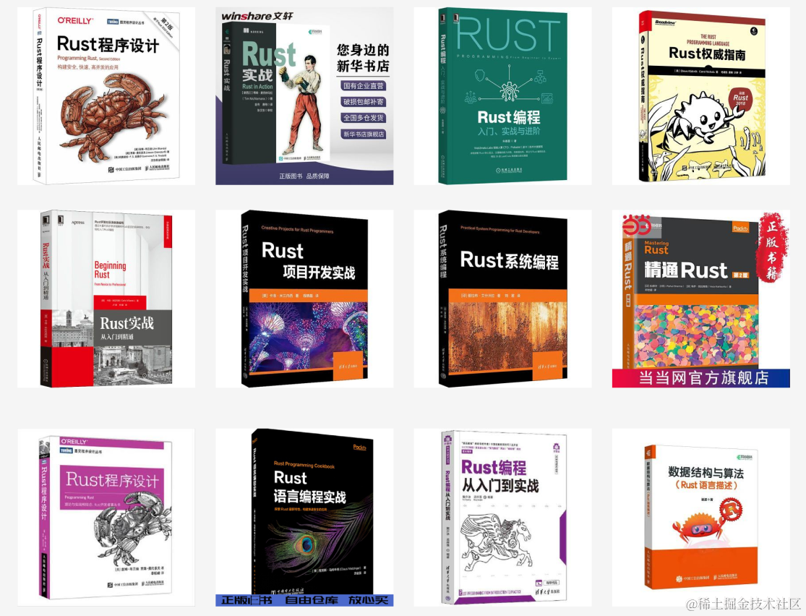

# Awesome-Rust-CN

## 视频基础课
- [【B站 UP程序员令狐壹冲】 - Rust编程视频教程（基础）](https://www.bilibili.com/video/BV1xJ411B79h/?spm_id_from=333.999.0.0&vd_source=90df2f0009973852429343b5103707c3)
- [【收费 慕课网 】轻松实现Rust系统入门，实战编译器开发](https://coding.imooc.com/class/ds/517)
- [【B站 清华大学】Rust程序设计](https://www.bilibili.com/video/BV1kF411R749?p=1&vd_source=90df2f0009973852429343b5103707c3)
- [【B站 UP程序员令狐壹冲】Rust编程视频教程（进阶）](https://www.bilibili.com/video/BV1FJ411Y71o/?spm_id_from=333.337.search-card.all.click&vd_source=90df2f0009973852429343b5103707c3)
- [【B站 软件工艺师】Rust编程语言入门教程](https://www.bilibili.com/video/BV1hp4y1k7SV/?spm_id_from=333.337.search-card.all.click&vd_source=90df2f0009973852429343b5103707c3)

## Rust出版书籍

1. [Rust程序设计 第2版](https://p.pinduoduo.com/sFUOvXC6)
4. [Rust实战](https://p.pinduoduo.com/FGaOHvhO)
6. [Rust编程 入门、实战与进阶](https://p.pinduoduo.com/DXdOaMdT)
8. [Rust权威指南](https://p.pinduoduo.com/jK2O69Oa)
10. [Rust实战：从入门到精通](https://p.pinduoduo.com/oqTOFJxQ)
12. [Rust项目开发实战](https://p.pinduoduo.com/lLxO0lX4)
14. [Rust系统编程](https://p.pinduoduo.com/A1MOHzJ7)
16. [精通Rust 第2版](https://p.pinduoduo.com/sMWOAKTV)
18. [Rust程序设计](https://p.pinduoduo.com/4tZOxdFM)
20. [Rust语言编程实战](https://p.pinduoduo.com/rk0O9SSx)
22. [Rust编程从入门到实战](https://p.pinduoduo.com/rEKO1qI8)

## 文字专栏
- [【收费 极客时间】陈天 · Rust 编程第一课](http://gk.link/a/12fNm)
- [【收费 极客时间】Rust 语言从入门到实战-唐刚](http://gk.link/a/12fNn)

## 学习资料网站
- [Rust语言圣经(Rust Course)](https://course.rs/about-book.html)
- [Rust 官方文档中文教程](https://www.rustwiki.org.cn/)
- [Rust语言中文社区](https://rustcc.cn/)

- [跟Google学Rust](https://google.github.io/comprehensive-rust/)
- [官网 Learn Rust](https://www.rust-lang.org/learn)
- [The Rust Programming Language](https://doc.rust-lang.org/book/)
- [The Rust Programming Language (interactive learning experience)](https://rust-book.cs.brown.edu/)
- [rustlings](https://rustlings.cool/)
- [跟例子学Rust](https://doc.rust-lang.org/rust-by-example/)
- [Rust标准库](https://doc.rust-lang.org/std/index.html)
- [Rust 版本指南](https://doc.rust-lang.org/edition-guide/index.html)
- [Cargo详解](https://doc.rust-lang.org/cargo/index.html)
- [Rust编译器介绍](https://doc.rust-lang.org/rustc/index.html)
- [Rust编译器报错说明手册](https://doc.rust-lang.org/error-index.html)
- [Rust 完全手册](https://doc.rust-lang.org/reference/index.html)
- [Rust 'nomicon - unsafe黑暗魔法卷轴 ](https://doc.rust-lang.org/nomicon/index.html)

## Rust IDE工具
- [RustRover](https://www.jetbrains.com/rust/)

## 常用的三方库
#### 1. 仓库
- [第三方Rust package仓库](https://lib.rs/)
- [官方Rust package仓库](https://crates.io/)

#### 2. 三方库
- [Tokio - 异步运行时](https://github.com/tokio-rs/tokio)
- [axum - WEB 框架](https://github.com/tokio-rs/axum)
- [io-uring封装](https://github.com/tokio-rs/io-uring)
- [tonic - Rust gRPC 的Rust实现](https://github.com/hyperium/tonic)
- [prost - Protocol Buffers 的Rust实现](https://github.com/tokio-rs/prost)
- [rust-tdlib](https://github.com/antonio-antuan/rust-tdlib)
- [serde - 序列化与反序列化库](https://github.com/serde-rs/serde)
- [serde_json - json序列化与反序列化库](https://github.com/serde-rs/json)
- [Tauri - 图形化跨端框架，Rust版的electron](https://tauri.app/)

## Rust编程学习群

